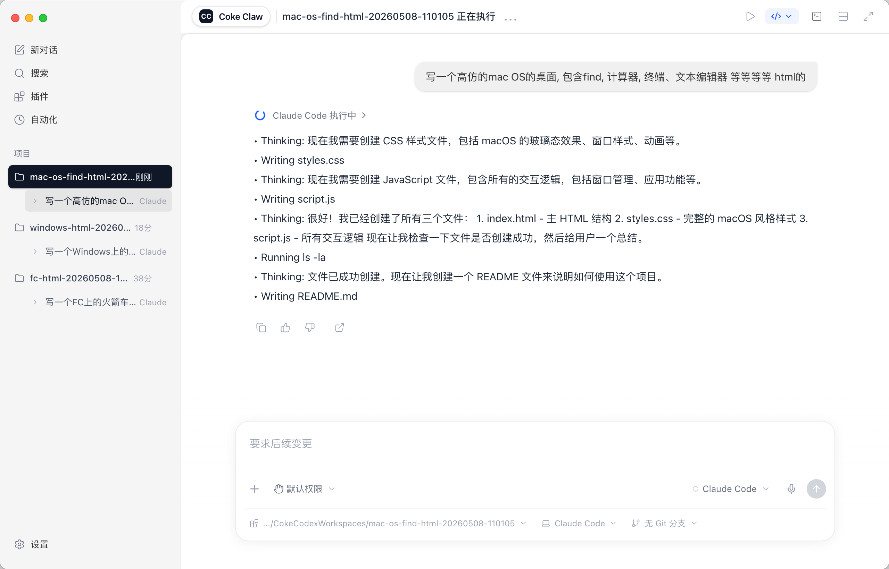
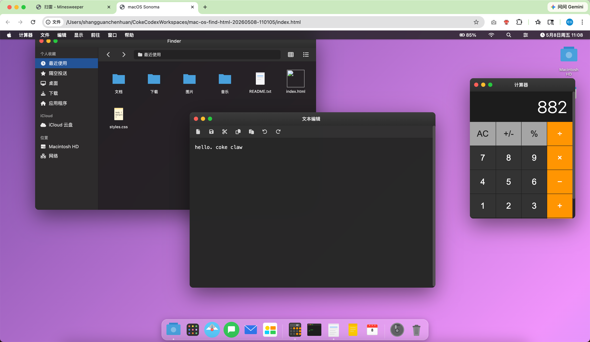
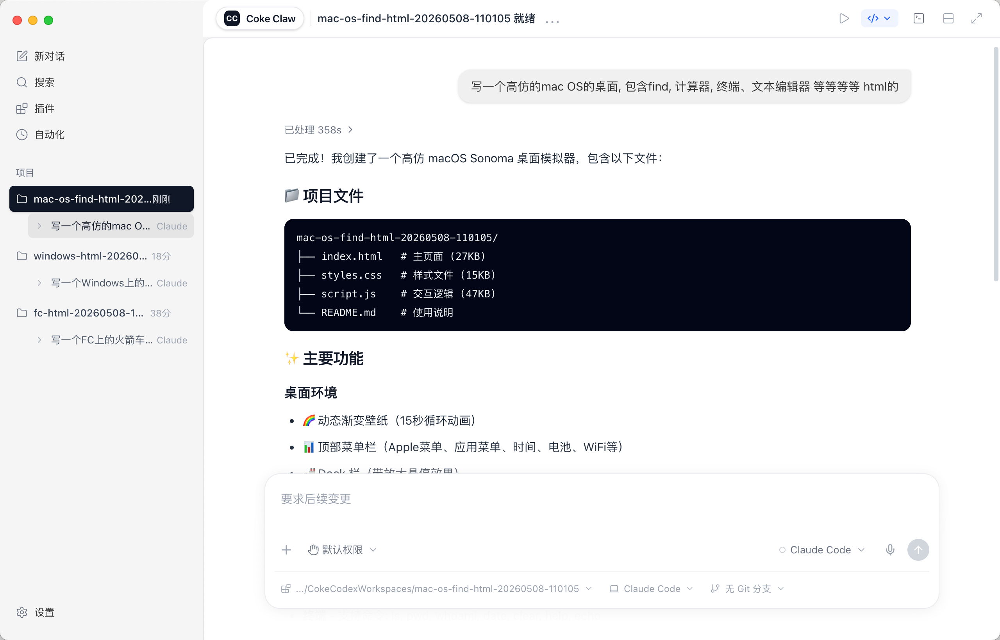
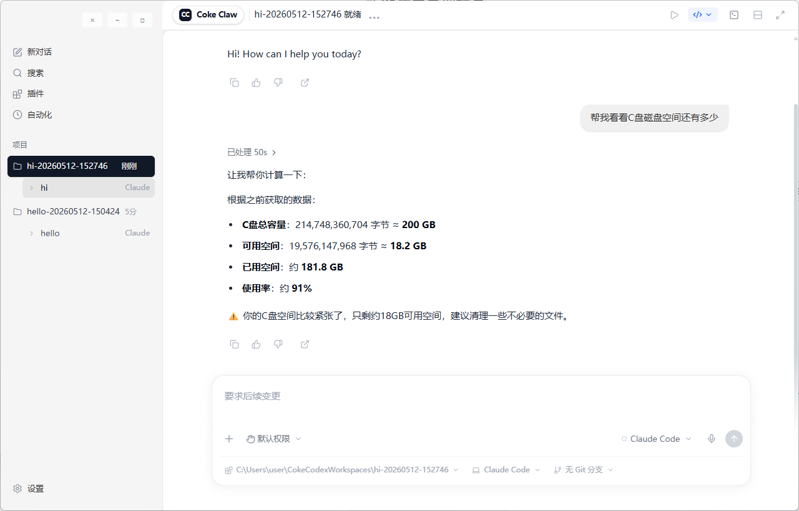
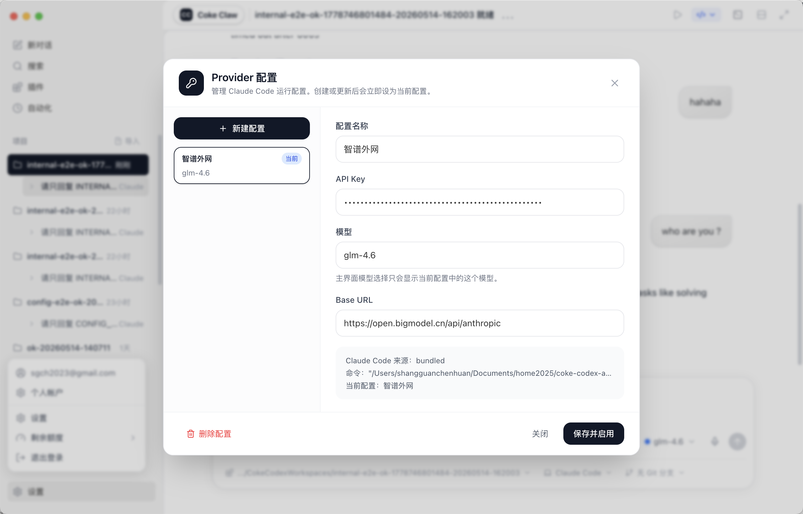
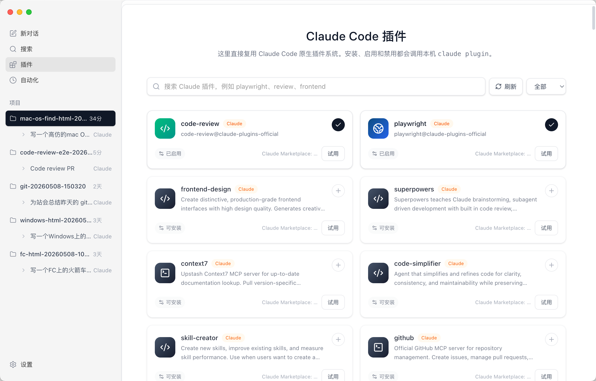
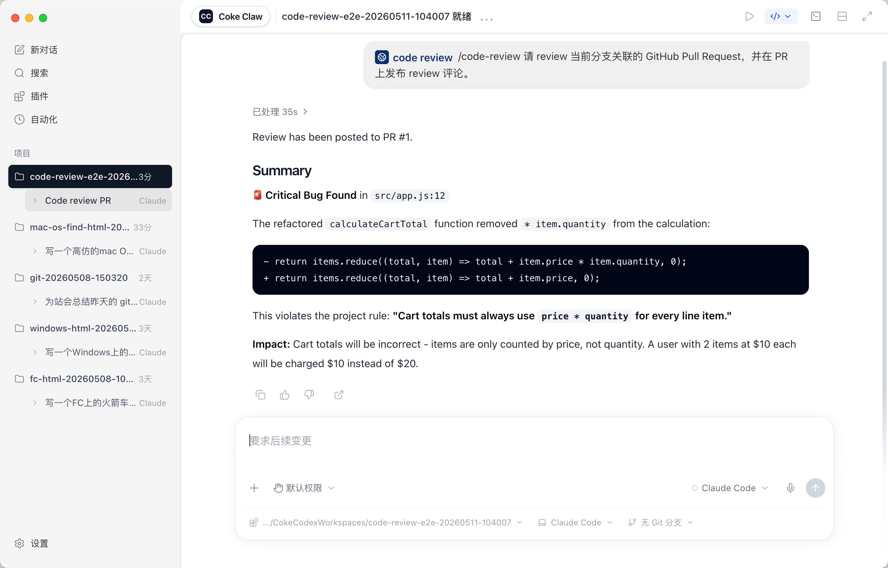
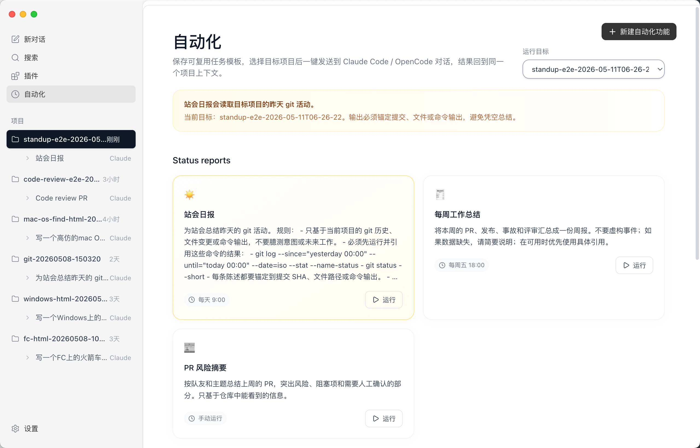
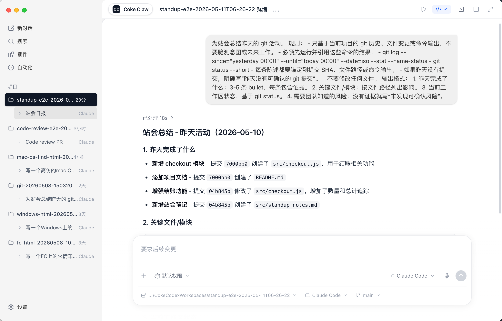

# Coke Codex

Coke Codex is a desktop app that wraps Claude Code and OpenCode with a Codex-style interface.

The public release package includes the desktop shell and bundled Claude Code runtime. After installation, open **Settings** and enter your model provider API key before starting a conversation.

## Download

Download the latest builds from the GitHub Releases page:

https://github.com/cokepoppy/coke-codex-app-public/releases

Current packages:

- Windows 10+ x64: https://github.com/cokepoppy/coke-codex-app-public/releases/download/v0.1.4/Coke.Codex-0.1.4-x64-setup.exe
- Windows 10+ arm64: https://github.com/cokepoppy/coke-codex-app-public/releases/download/v0.1.4/Coke.Codex-0.1.4-arm64-setup.exe
- Windows combined installer: https://github.com/cokepoppy/coke-codex-app-public/releases/download/v0.1.4/Coke.Codex-0.1.4-setup.exe
- macOS Apple Silicon DMG: https://github.com/cokepoppy/coke-codex-app-public/releases/download/v0.1.4/Coke.Codex-0.1.4-arm64.dmg
- macOS Apple Silicon ZIP: https://github.com/cokepoppy/coke-codex-app-public/releases/download/v0.1.4/Coke.Codex-0.1.4-arm64-mac.zip

## Highlights

- Project-based conversations stored under `~/CokeCodexWorkspaces`
- Claude Code and OpenCode conversation modes
- Codex-style plugin cards and chat composer integration
- Browser-use style workflow for testing local web pages
- Automation entry points, including standup report generation
- Built-in terminal and quick-open support for local project folders
- Runtime settings for model, API key, and provider endpoint

## Screenshots

### Chat







### Windows 10+



### Provider 配置



### Plugins



### Code Review



### Automation





## Setup

1. Install the Windows `.exe` package or macOS `.dmg` package.
2. Open **Coke Codex**.
3. Open **Settings**.
4. Fill in your API key, model, and provider endpoint.
5. Start a new conversation or open an existing project.

Example model settings:

```text
Model: zhipu-openai/glm-4.6
Base URL: https://open.bigmodel.cn/api/anthropic
```

API keys are stored in the app runtime settings on your machine and are not committed to this repository.
