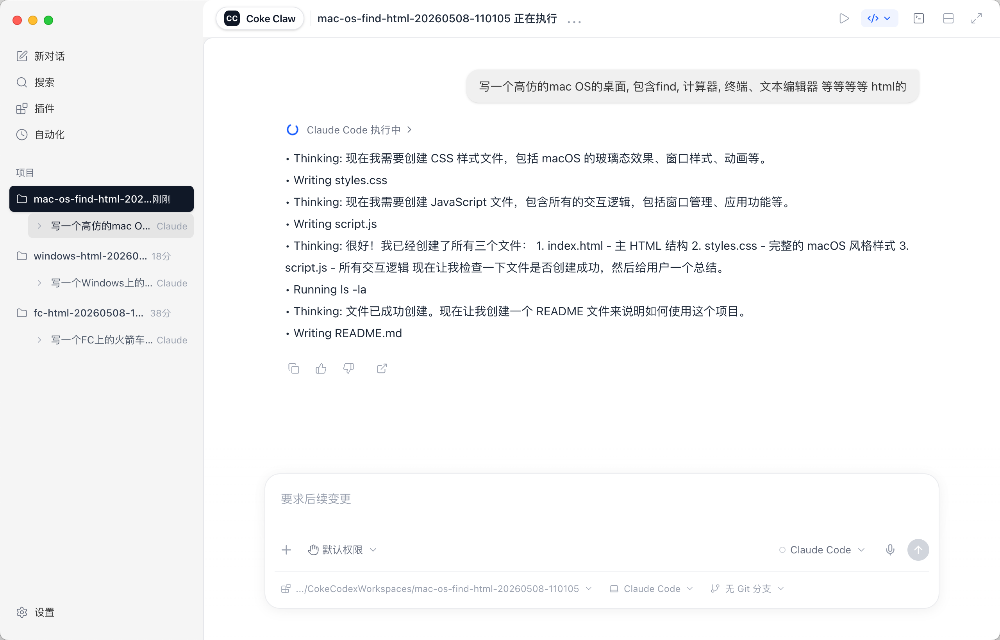
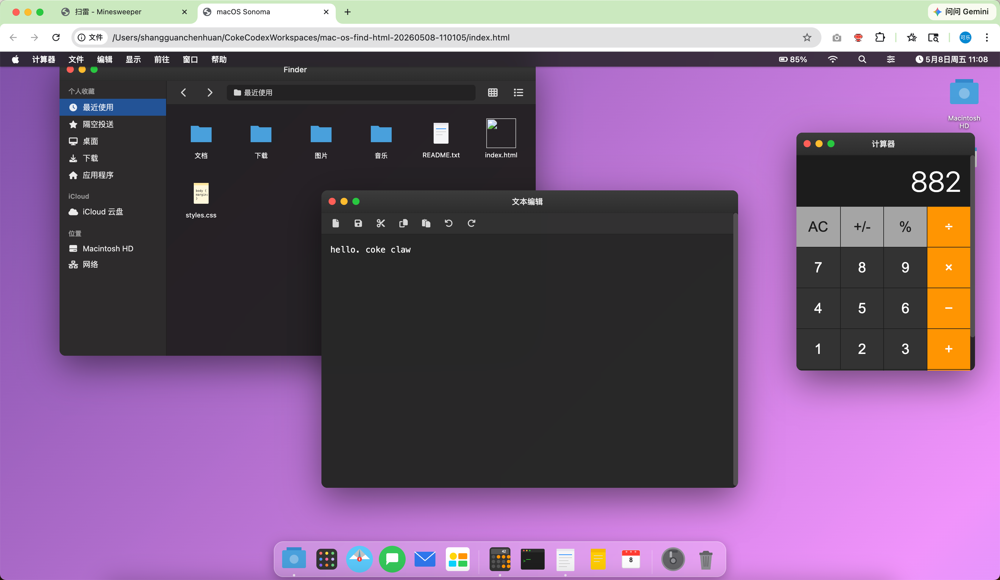
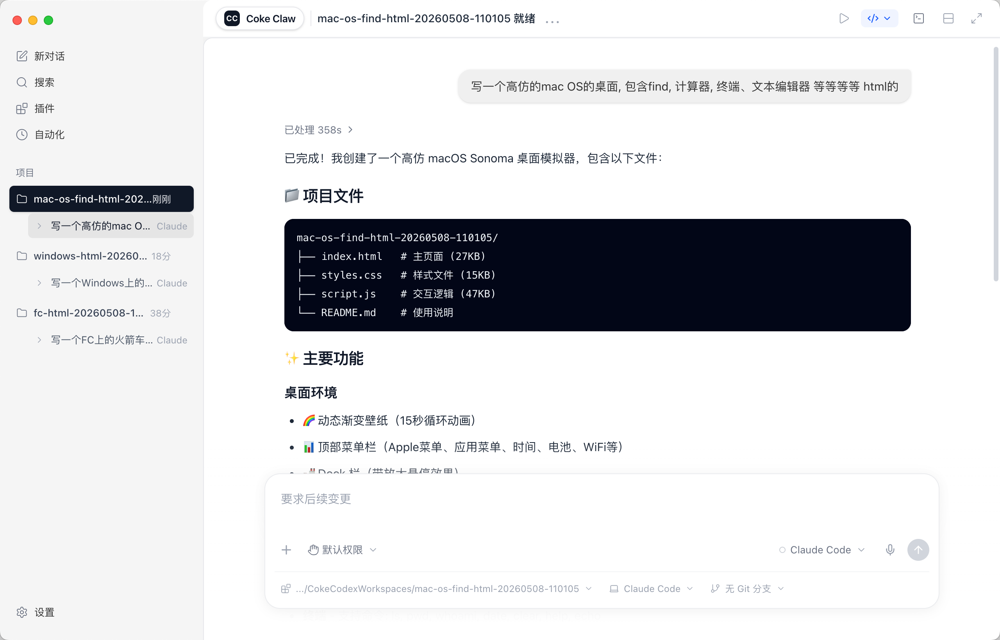
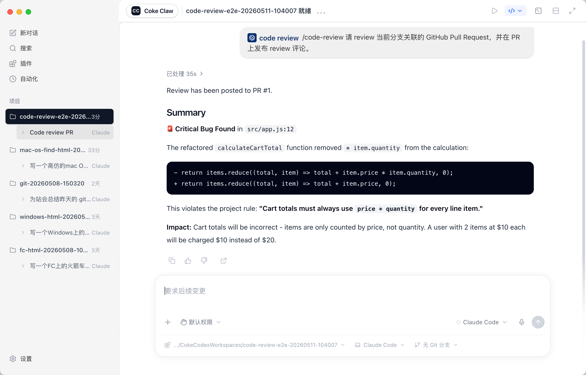
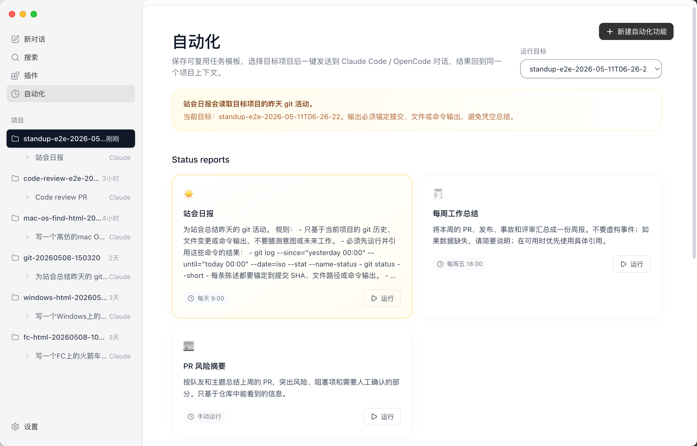
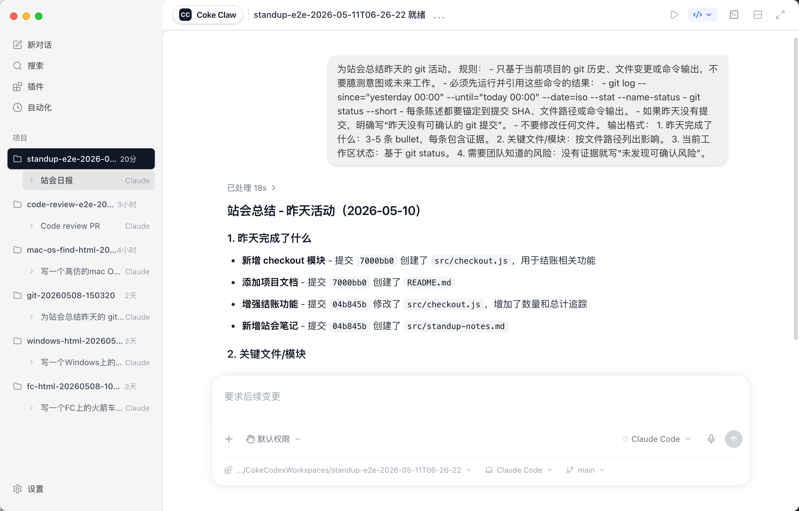

# Coke Codex

Coke Codex 是一个桌面端 Agent 客户端，内置 Claude Code 运行时，并提供 Codex 风格的项目、对话、插件、自动化、终端和金融投研工作流界面。

## 下载

最新版本：`v0.1.10`

- Windows 10/11 x64 安装包：<https://github.com/cokepoppy/coke-codex-app-public/releases/download/v0.1.10/Coke-Codex-0.1.10-x64-setup.exe>
- macOS Apple Silicon DMG：<https://github.com/cokepoppy/coke-codex-app-public/releases/download/v0.1.10/Coke-Codex-0.1.10-arm64.dmg>
- macOS Apple Silicon ZIP：<https://github.com/cokepoppy/coke-codex-app-public/releases/download/v0.1.10/Coke-Codex-0.1.10-arm64.zip>
- 全部版本：<https://github.com/cokepoppy/coke-codex-app-public/releases>

Landing Page：<https://cokepoppy.github.io/coke-codex-app-public/>

## API Key 设置

首次启动后，点击左下角 `设置`，选择 `API Key` 登录方式，然后新增一个 Provider 配置。配置会保存在本机应用数据目录，不会提交到仓库。

需要填写 4 项：

- `配置名称`：自己能看懂即可，例如 `智谱 Coding Plan`、`小米 MiMo`、`DeepSeek`。
- `API Key`：对应模型服务商给你的 key。
- `模型`：必须填写服务商实际支持的模型名，不要额外加 `openai/`、`zhipu-openai/`、`anthropic/` 这类前缀。
- `Base URL`：填写 Claude/Anthropic 兼容接口地址。

### 智谱 Coding Plan

```text
配置名称：智谱 Coding Plan
API Key：填写你的智谱 Coding Plan API Key
模型：glm-4.6
Base URL：https://open.bigmodel.cn/api/anthropic
```

注意：模型填写 `glm-4.6`。不要写成 `zhipu-openai/glm-4.6`，这个前缀是旧文档里的错误写法。

### 小米 MiMo

```text
配置名称：小米 MiMo
API Key：填写你的 token-plan API Key
模型：mimo-v2.5
Base URL：https://token-plan-sgp.xiaomimimo.com/anthropic
```

### DeepSeek

```text
配置名称：DeepSeek
API Key：填写你的 DeepSeek API Key
模型：deepseek-v4-flash
Base URL：https://api.deepseek.com/anthropic
```

如果你的账号开通的是其他 DeepSeek Anthropic 兼容模型，也可以把模型名替换成服务商控制台显示的模型，例如 `deepseek-v4-pro`。

## 使用步骤

1. 安装 Windows `.exe` 或 macOS `.dmg`。
2. 打开 `Coke Codex`。
3. 进入 `设置`，选择 `API Key`。
4. 新增 Provider，按上面的示例填写 `API Key`、`模型` 和 `Base URL`。
5. 点击 `保存并启用`。
6. 回到主界面，新建项目或导入已有项目后开始对话。

## 常见问题

### 为什么提示模型不存在？

通常是 `模型` 填错了，或者模型名带了不该带的 provider 前缀。Coke Codex 会把设置里的模型名直接传给 Claude Code，所以要填写服务商真实模型代码。

例如智谱 Coding Plan 应填：

```text
glm-4.6
```

不要填：

```text
zhipu-openai/glm-4.6
```

### 为什么提示没有配置 Provider？

当前没有启用任何 Provider。打开 `设置`，选择一个已有配置，或新增配置后点击 `保存并启用`。

### API Key 存在哪里？

API Key 存在本机应用运行配置中，仅供本机 Claude Code 调用链使用。

## Highlights

- 项目级对话与工作目录管理
- 内置 Claude Code 运行时
- Provider 配置管理，支持智谱 Coding Plan、小米 MiMo、DeepSeek 等 Claude 兼容接口
- Markdown 聊天渲染、文件上传、真实终端和代码编辑器打开
- 插件、自动化、站会日报和金融证券专家工作流
- 金融行情卡片、TradingView 图表和数据源管理

## Screenshots

### Chat







### Windows 10+


### Provider 配置


### Plugins


### Code Review



### Automation




